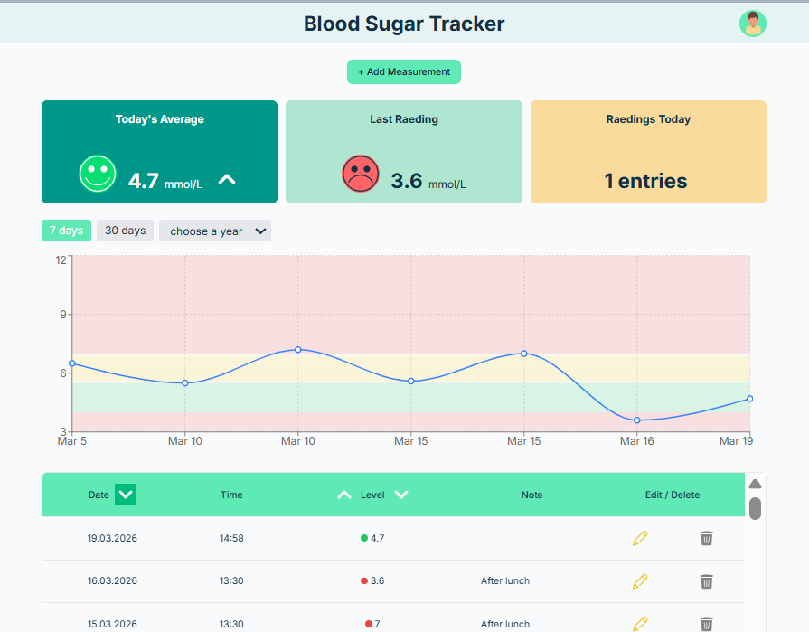

## 🩸 Blood Sugar Tracker

> Простий і зручний застосунок для відстеження рівня цукру в крові 📊  
> Допомагає аналізувати показники, знаходити піки та контролювати здоров'я

  

---

## 🚀 Live Demo

 🔗 [Blood Sugar Tracker](https://blood-sugar-tracker-nu.vercel.app/)

---

## ⚡ Основні можливості

- 📅 Додавання записів з датою та часом  
- 📊 Візуалізація даних через графіки  
- 🔍 Аналіз максимальних і мінімальних значень  
- 📈 Відстеження динаміки рівня цукру  
- 🗑️ Видалення записів  
- 📱 Адаптивний інтерфейс  

---

## 🧠 Технології

Проєкт побудований на сучасному стеку:

- ⚛️ React 19  
- ⚡ Vite  
- 🟦 TypeScript  
- 🎨 Tailwind CSS  
- 📊 Recharts  
- 📅 react-datepicker  
- 🧩 Flowbite React  
